# Architecture — E-Commerce Full-Stack Platform

| | |
|---|---|
| **Document type** | Software Architecture Document |
| **Companion document** | `prd.md` (Product Requirements Document) |
| **Project type** | Capstone: monolith → microservices → event-driven → analytics platform |
| **Last updated** | September 2026 |

## Status Legend

Every component in this document carries one of these labels. Planned components are **not** claimed to exist.

| Label | Meaning |
|---|---|
| ✅ **IMPLEMENTED** | Built and verified end-to-end |
| 🔧 **IN PROGRESS** | Actively being built |
| ⏭️ **NEXT** | The immediately following phase |
| 📋 **PLANNED** | Designed, not yet built |
| 🔮 **FUTURE** | Possible enhancement, not committed |

### Current Component Status

| Component | Status |
|---|---|
| Eureka Server (:8761) | ✅ IMPLEMENTED + VERIFIED |
| User Service (:8081) | ✅ IMPLEMENTED + VERIFIED |
| Product Service (:8082) | ✅ IMPLEMENTED + VERIFIED |
| Order Service (:8083) — includes Cart | ✅ IMPLEMENTED + VERIFIED |
| Spring Cloud OpenFeign | ✅ IMPLEMENTED + VERIFIED |
| JWT propagation between services | ✅ IMPLEMENTED + VERIFIED |
| Service discovery (Eureka + Feign) | ✅ IMPLEMENTED + VERIFIED |
| API Gateway (Spring Cloud Gateway, :8080) | ⏭️ NEXT |
| Cart & Checkout Service | 📋 PLANNED (extraction from Order Service) |
| Payment Service | 📋 PLANNED |
| Kafka | 📋 PLANNED |
| Saga + compensation | 📋 PLANNED |
| Resilience4j | 📋 PLANNED |
| Elasticsearch search | 📋 PLANNED |
| Notification Service | 📋 PLANNED |
| WebSocket | 📋 PLANNED |
| Distributed tracing (OpenTelemetry + Zipkin-compatible) | 📋 PLANNED |
| Config Server (Spring Cloud Config) | 📋 PLANNED |
| Docker / Docker Compose | 📋 PLANNED |
| HDFS | 📋 PLANNED |
| Spark / Analytics Service | 📋 PLANNED |

---

## Table of Contents

1. Architecture Overview
2. Project Goals
3. Architecture Evolution
4. Current Architecture
5. Target Architecture
6. System Context
7. Container / Service Architecture
8. Service Responsibilities
9. Domain Model
10. Database Architecture
11. Database Ownership
12. API Architecture
13. Authentication Architecture
14. Authorization / RBAC
15. JWT Flow
16. Refresh Token Flow
17. OpenFeign Communication
18. Eureka Service Discovery
19. API Gateway
20. Kafka Architecture
21. Event Design
22. Saga Architecture
23. Compensation
24. Inventory Concurrency
25. Elasticsearch
26. Notification / WebSocket
27. Resilience4j
28. Distributed Tracing
29. Logging / Observability
30. Docker
31. Configuration Management
32. HDFS
33. Spark
34. Analytics Pipeline
35. Testing Architecture
36. Security Architecture
37. Scalability
38. Reliability
39. Deployment Architecture
40. Development Roadmap
41. Architecture Decisions (ADRs)
42. Trade-offs
43. Risks
44. Future Enhancements

---

## 1. Architecture Overview

The **E-Commerce Full-Stack Platform** is a production-oriented marketplace supporting three roles: **Buyers**, **Sellers**, and **Administrators**. The frontend is React.js; the backend is Spring Boot, with MySQL as the transactional store.

The project deliberately began as a **modular monolith** so that a working business application existed first. Distributed-system technologies are introduced **incrementally**, each solving a concrete problem created by the previous step. The system is currently in the **microservices migration phase**.

Guiding idea: *no technology is added for its own sake.* Each one has an architectural purpose stated in this document.

## 2. Project Goals

| Goal | Description |
|---|---|
| Business | Registration/authentication, role-based access, address, product, category, inventory, cart, checkout, order creation/history/cancellation |
| Distributed systems | Inter-service communication, service discovery, API gateway, event-driven communication, Saga-based distributed transactions |
| Platform capabilities | Product search, real-time notifications, fault tolerance, distributed tracing, containerization |
| Data | Big-data analytics over historical order data |
| Learning | The architecture evolution itself is documented, so a reader understands *why* each step was taken |

## 3. Architecture Evolution

```text
React → Spring Boot → MySQL → Working E-Commerce Application
   → Microservice Decomposition → OpenFeign → Eureka → API Gateway
   → Kafka → Saga → Resilience4j → Elasticsearch → WebSocket Notifications
   → Distributed Tracing → Docker → HDFS / Hadoop → Spark Analytics
```

| Stage | Problem it solves | Status |
|---|---|---|
| Modular monolith (React + Spring Boot + MySQL) | Establish working business functionality | ✅ Done |
| Microservice decomposition | Independent ownership, scaling, deployment | ✅ User, Product, Order extracted |
| OpenFeign | Services need synchronous calls without hand-written HTTP code | ✅ |
| Eureka | Hardcoded service URLs are brittle; instances change | ✅ |
| API Gateway | Frontend should not know every service URL; central cross-cutting concerns | ⏭️ NEXT |
| Cart & Checkout extraction | Cart currently lives in Order Service | 📋 |
| Payment Service | Payment is a separate business capability | 📋 |
| Kafka | Loose coupling, asynchronous events | 📋 |
| Saga | `@Transactional` cannot span service databases | 📋 |
| Resilience4j | Synchronous calls fail; need containment | 📋 |
| Elasticsearch | Full-text/fuzzy search beyond SQL capabilities | 📋 |
| WebSocket | Real-time notifications without polling | 📋 |
| Tracing | Follow one request across many services | 📋 |
| Docker | Reproducible, portable deployment | 📋 |
| HDFS + Spark | Historical analytics at scale | 📋 |

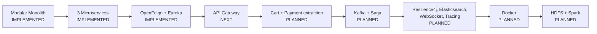

## 4. Current Architecture

**Status: ✅ IMPLEMENTED + VERIFIED**

Three business microservices plus a Eureka server. The React frontend currently reaches services directly (no gateway yet). Order Service calls User Service and Product Service through OpenFeign; targets are resolved through Eureka by logical name.

| Component | Port | Database |
|---|---|---|
| Eureka Server | 8761 | — |
| User Service | 8081 | `user_db` |
| Product Service | 8082 | `product_db` |
| Order Service | 8083 | `order_db` |

All three services register with Eureka and appear as `UP`.

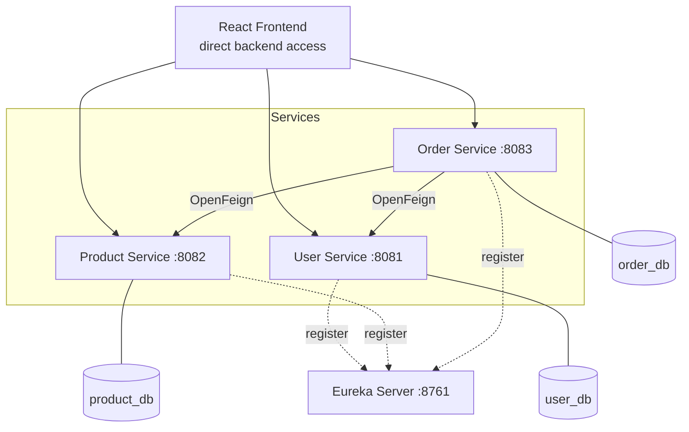

### Verified End-to-End Business Flow

The following flow has been tested successfully:

```text
Seller Login → Create Category → Create Product → Create Inventory
→ Buyer Login → Create Address → Add Product to Cart → Get Cart
→ Create Order → Order Service calls Product Service → Inventory Reservation
→ Order Creation → Order Items → Order Address Snapshot → Cart Cleared
→ Post-order inventory state verified → Order history verified
```

### Known Limitation (intentional intermediate stage)

Order creation calls Product Service synchronously to reserve inventory. Although Order Service uses `@Transactional`, that transaction covers **only `order_db`**. It does **not** include `product_db`. A failure *after* a successful inventory reservation can leave distributed state inconsistent (stock reserved, order not created). This is resolved in the target architecture by Saga + compensation (§22–23). **The current `@Transactional` does not provide distributed atomicity.**

## 5. Target Architecture

**Status: 📋 PLANNED** (everything beyond the current architecture)

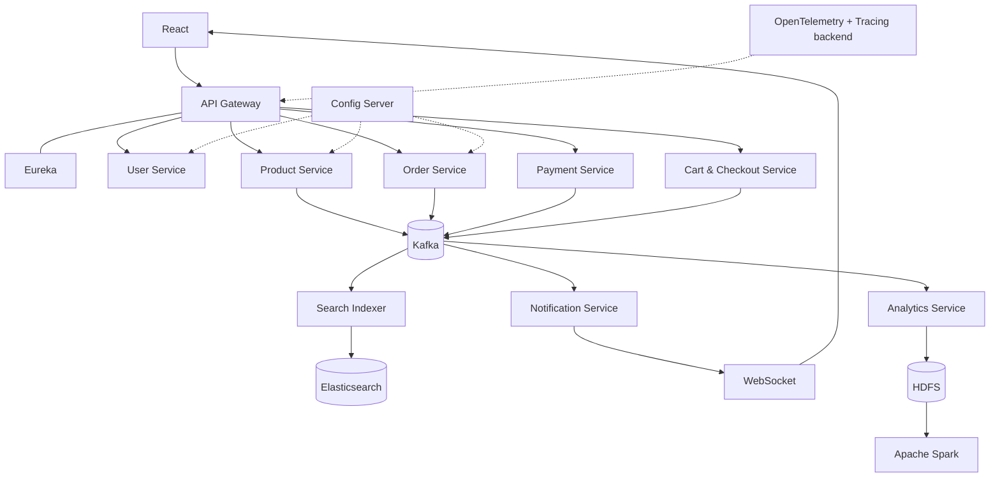

Supporting infrastructure: Docker, Eureka, Config Server, Kafka, MySQL, Elasticsearch, HDFS, Spark, OpenTelemetry, tracing backend, Resilience4j.

### Current vs. Next vs. Final

| Aspect | Current ✅ | Next ⏭️ | Final 📋 |
|---|---|---|---|
| Client entry | Direct to services | API Gateway :8080 | API Gateway |
| Discovery | Eureka | Eureka (Gateway uses it) | Eureka |
| Inter-service sync | OpenFeign | OpenFeign | OpenFeign + Resilience4j |
| Async | None | None | Kafka |
| Distributed transaction | Not handled (limitation) | — | Saga + compensation |
| Search | MySQL filters | — | Elasticsearch |
| Notifications | None | — | Kafka → Notification Service → WebSocket |

## 6. System Context

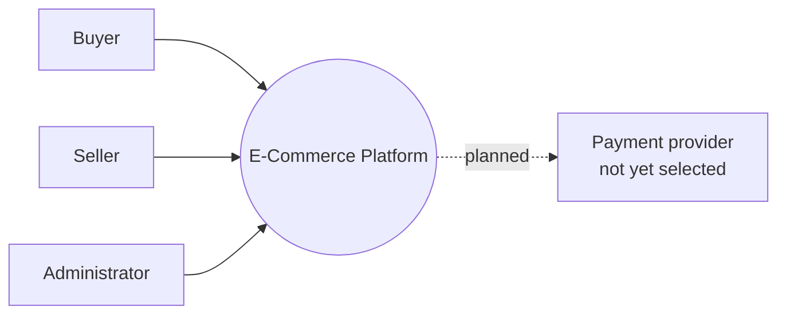

No specific payment provider is chosen; that decision is deferred.

## 7. Container / Service Architecture

| Container | Tech | Status |
|---|---|---|
| Frontend | React.js | ✅ (direct backend access today) |
| API Gateway | Spring Cloud Gateway | ⏭️ NEXT |
| Eureka Server | Spring Cloud Netflix Eureka | ✅ |
| User Service | Spring Boot, Spring Security, JWT, JPA | ✅ |
| Product Service | Spring Boot, JPA, JWT validation | ✅ |
| Order Service | Spring Boot, JPA, OpenFeign | ✅ |
| Cart & Checkout Service | Spring Boot | 📋 |
| Payment Service | Spring Boot | 📋 |
| Notification Service | Spring Boot, Kafka consumer, WebSocket | 📋 |
| Analytics Service | Kafka consumer → HDFS, Spark jobs | 📋 |
| Search Indexer | Kafka consumer → Elasticsearch | 📋 |
| Config Server | Spring Cloud Config | 📋 |

## 8. Service Responsibilities

### 8.1 User Service ✅
- Registration (Buyer, public Seller), login, logout
- JWT access token + refresh token (HttpOnly cookie), refresh token revocation
- Role-based authorization (`BUYER`, `SELLER`, `ADMIN`)
- Profile retrieval/update, user retrieval/deletion
- Address CRUD with default-address handling
- Phone collection
- Owns: `user_db`

### 8.2 Product Service ✅
- Products, categories, inventory
- Search/filter/pagination via MySQL
- Bulk product retrieval for Order Service
- Inventory reserve/release/deduct
- Validates JWT independently; holds **no** User entity
- Owns: `product_db`

### 8.3 Order Service ✅
- Cart and cart items (currently here)
- Order creation/checkout, order items, order address snapshot
- Order cancellation, buyer order history
- Calls User and Product services via OpenFeign
- Owns: `order_db`

### 8.4 Eureka Server ✅
Service registry (see §18).

### 8.5 API Gateway ⏭️
Single entry point (see §19).

### 8.6 Cart & Checkout Service 📋
Cart management, cart items, checkout orchestration, cart validation. Extracted **after** the Order Service flow is stable.

### 8.7 Payment Service 📋
Separate payment capability integrated with Order Service; participates in Saga. Provider not selected.

### 8.8 Notification Service 📋
Consumes Kafka events, pushes to React via WebSocket.

### 8.9 Analytics Service 📋
Consumes order events, writes to HDFS, coordinates Spark analytics.

## 9. Domain Model

### 9.1 User Service

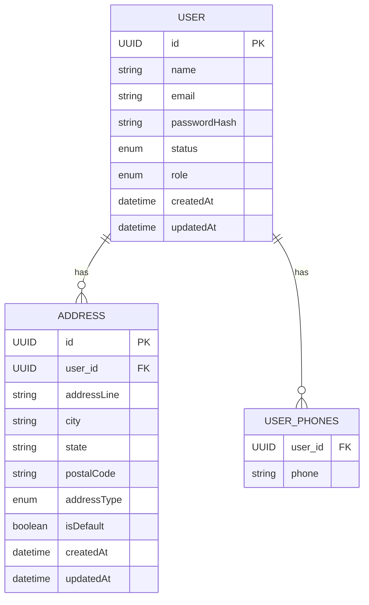

- IDs are UUIDs. Passwords are BCrypt hashes. Role and status are enums.
- **Phones:** modeled with `@ElementCollection` in table `user_phones`, avoiding a full Phone entity unless requirements demand it.
- **Address:** `AddressType` enum (e.g., `HOME`, `WORK`) is preserved. First address becomes default automatically; default-address state is governed by business rules.
- Roles: `BUYER`, `SELLER`, `ADMIN`. Public registration creates BUYER (`POST /api/auth/register`) or SELLER (`POST /api/auth/register/seller`). **No public Admin registration**; admin bootstrap is handled separately (implementation concern).

### 9.2 Product Service

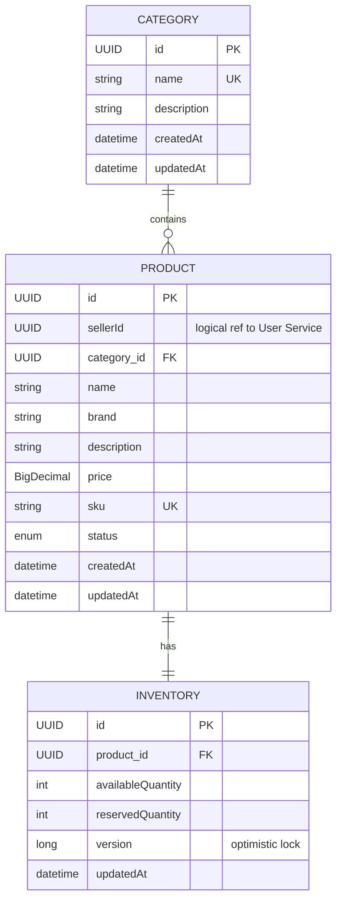

- Category names are unique; duplicates return **409 Conflict**. SKU is unique.
- Product ↔ Inventory is strictly **1:1**; an inventory record never represents multiple products.

### 9.3 Order Service

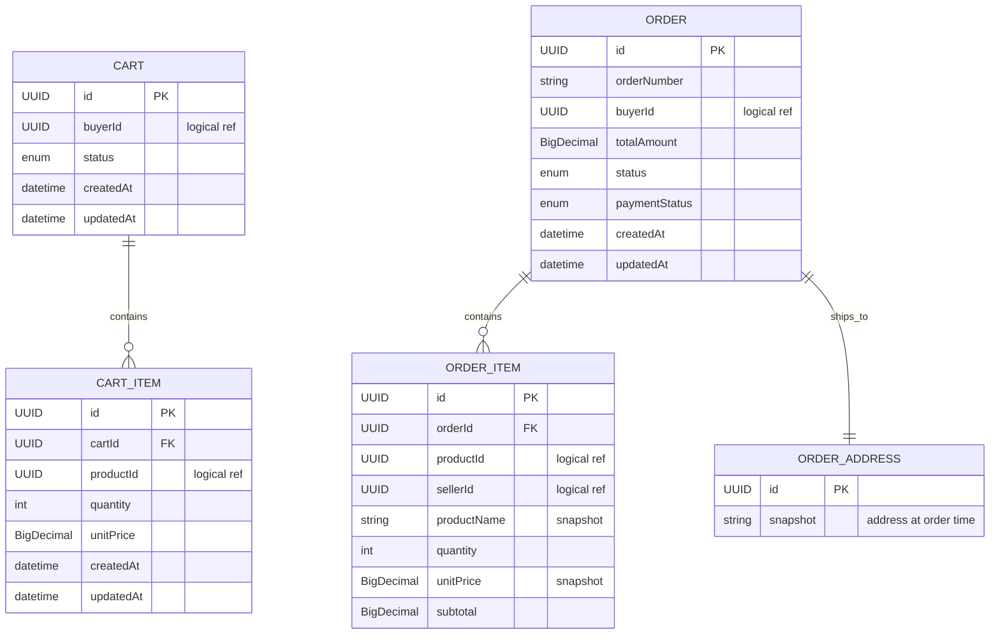

**Order Snapshot Principle.** At order creation, `productName`, `unitPrice`, and `sellerId` are copied into `OrderItem`, and the buyer's address is copied into `OrderAddress`. If a product price later changes from ₹500 to ₹700, the historical order still shows ₹500. Historical orders never depend on current Product Service data.

**Order status lifecycle**

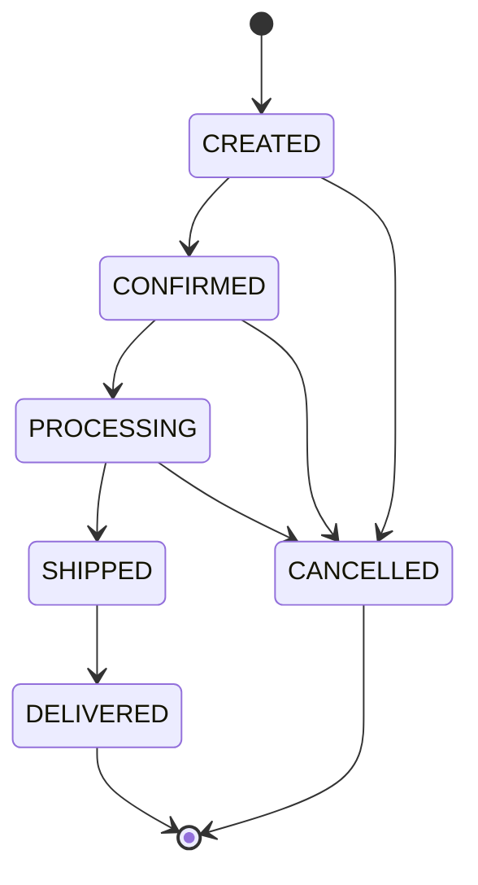

Order Service enforces transition rules. **Payment status** is kept separate from order status (currently `PENDING`); additional states are added when Payment Service is implemented.

### 9.4 Cross-Service Logical References

| Reference | Points to |
|---|---|
| `Product.sellerId` | User Service |
| `Order.buyerId` | User Service |
| `OrderItem.productId` | Product Service |
| `OrderItem.sellerId` | User Service |
| `Cart.buyerId` | User Service |
| `CartItem.productId` | Product Service |

These are **logical** IDs only. No physical foreign keys cross service databases.

### 9.5 Same-Service JPA Relationships

Normal JPA relationships remain valid inside one service: Product→Category, Inventory→Product, Cart→CartItem, Order→OrderItem, Order→OrderAddress, User→Address.

## 10. Database Architecture

**Initial monolith (historical):** a single MySQL schema containing `users, roles, user_roles, user_phones, addresses, categories, products, inventory, carts, cart_items, orders, order_items, order_addresses, refresh_tokens`.

**Current microservices ✅:** `user_db`, `product_db`, `order_db`.

**Planned additions 📋:** `processed_events` table in each Kafka-consuming service; payment database with Payment Service; Elasticsearch index (read-optimized, not a source of truth); HDFS partitioned storage for analytics.

## 11. Database Ownership

**Rule:** a service never directly accesses another service's database.

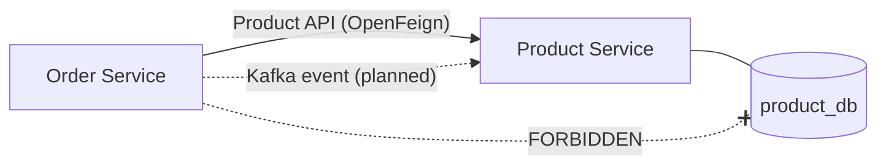

Cross-service data flows through **APIs** (synchronous) or **Kafka events** (asynchronous, planned).

## 12. API Architecture

**Principles:** REST conventions, nouns not verbs, correct HTTP methods and status codes, DTO-based contracts, pagination, validation, consistent response wrappers, no leakage of DB internals.

### 12.1 DTO Architecture

```text
Request DTO → Controller → Service → Entity → Repository
Entity → Mapper → Response DTO → Controller → JSON
```

Entities are never exposed. DTOs control contracts, prevent leakage, separate persistence from API models, enable validation, and improve maintainability.

### 12.2 Validation

Jakarta Bean Validation (`@NotBlank, @NotNull, @Email, @Size, @Positive, @DecimalMin, @Min`). Invalid requests → **400**, using the existing `ValidationErrorResponse` (`success, message, errors, timestamp`).

### 12.3 Error Handling

Global `@RestControllerAdvice`. Existing models: `ErrorResponse` (`message, status, timestamp`) and `ValidationErrorResponse`. Known exceptions: `ResourceNotFoundException`, `ConflictException`, `InsufficientStockException`, `InvalidInventoryOperationException`, `ForbiddenException`, `CartException`. No duplicate error models should be created.

### 12.4 Response Wrappers

`ApiResponse<T>` wraps API responses; `PageResponse<T>` wraps paginated data (`content, page, size, totalElements, totalPages, first, last`). Pagination applies to Products, Orders, Users, and Search results.

### 12.5 HTTP Status Codes

`200, 201, 204, 400, 401, 403, 404, 409, 422, 429, 500, 503` used appropriately.

### 12.6 Endpoint Catalogue

**User Service ✅**

| Method | Path | Access |
|---|---|---|
| POST | `/api/auth/register` | Public → BUYER |
| POST | `/api/auth/register/seller` | Public → SELLER |
| POST | `/api/auth/login` | Public |
| POST | `/api/auth/refresh` | Public |
| POST | `/api/auth/logout` | Public |
| GET/PUT | `/api/users/me` | Authenticated |
| GET/DELETE | `/api/users/{id}` | Authenticated / role-restricted |
| — | `/api/address/...` (incl. `GET /api/address/user/{userId}/{addressId}`) | Authenticated |

The exact final address endpoint structure should follow the implemented controllers.

**Product Service ✅**

| Method | Path | Notes |
|---|---|---|
| GET | `/api/products` | Listing, search, `category`, `minPrice`/`maxPrice`, `page`/`size` |
| GET | `/api/products/{id}` | Retrieval |
| GET | `/api/products/seller/{sellerId}` | Seller products |
| POST/PUT/DELETE | `/api/products[/{id}]` | SELLER |
| GET | `/api/products/ids?ids=<UUIDs>` | Bulk lookup for inter-service use |
| — | Category and inventory endpoints | Category CRUD; inventory create/update/get/reserve/release/deduct |

Inter-service `ProductInfoResponse` is a lightweight DTO: `id, sellerId, name, sku, price, status`.

**Order Service ✅**

| Method | Path |
|---|---|
| POST | `/api/orders` |
| GET | `/api/orders` |
| GET | `/api/orders/{orderId}` |
| GET | `/api/orders/status/{status}` |
| PUT | `/api/orders/{orderId}/cancel` |

Cart endpoints support get cart, add item, update quantity, remove item, clear cart.

**Buyer identity is never accepted from the request body or query.** It is derived from the JWT via `CurrentUserService`, preventing a buyer from reading another buyer's orders by swapping a UUID.

**Planned 📋:** `GET /api/search/products?q=wireless` (Elasticsearch).

## 13. Authentication Architecture

**Status: ✅ IMPLEMENTED (User Service)**

Stack: Spring Security + JWT + Refresh Token + RBAC. User Service owns: User entity, repository, `UserDetailsService`, JWT authentication filter, security configuration, password encoder (BCrypt), authentication provider, authentication manager.

Public endpoints: `/api/auth/register`, `/api/auth/register/seller`, `/api/auth/login`, `/api/auth/refresh`, `/api/auth/logout`. All other endpoints require authentication.

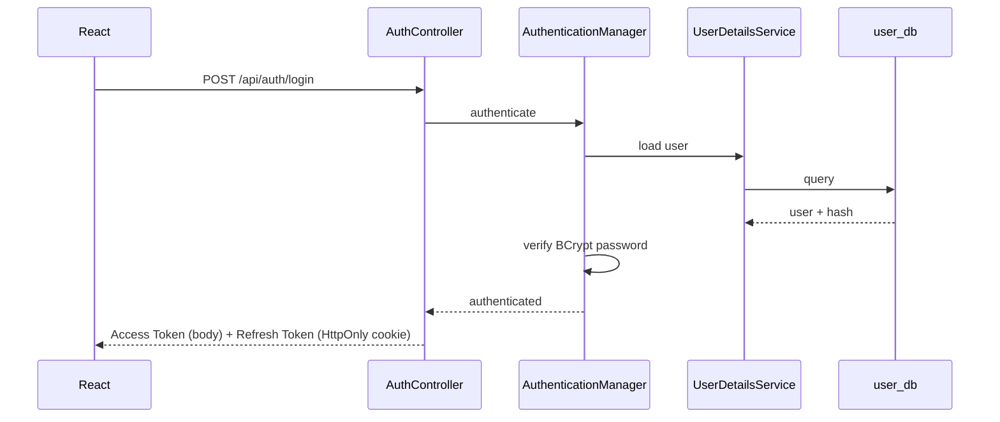

## 14. Authorization / RBAC

`@EnableMethodSecurity` with `@PreAuthorize("hasRole('SELLER')")` etc. Roles: `BUYER`, `SELLER`, `ADMIN`.

| Scenario | Expected |
|---|---|
| Unauthenticated → protected endpoint | 401 |
| Buyer → `POST /api/products` | 403 |
| Seller → own product | Allowed |
| Seller → another seller's inventory | Forbidden |
| Admin → administrative APIs | Allowed |

Seller ownership is verified before inventory/product modifications. **Product Service** does not maintain a user database; it uses `JwtService`, `JwtAuthenticationFilter`, `SecurityConfig`, and `CurrentUserService` to extract the authenticated UUID from the JWT. **Backend is the authoritative security boundary**; frontend route protection is UX, not security.

## 15. JWT Flow

- Clients send `Authorization: Bearer <access-token>`.
- Access tokens are short-lived.
- **Each service validates JWTs independently** (Product Service, Order Service, User Service).

### JWT Propagation Between Services ✅

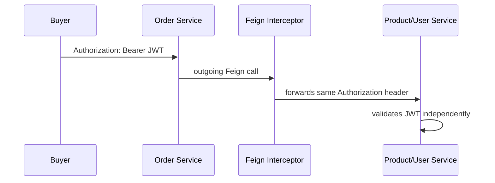

The Feign interceptor only **forwards** the header; it neither generates nor validates tokens.

## 16. Refresh Token Flow

Refresh tokens are longer-lived, revocable, and stored via a secure **HttpOnly cookie**. Logout revokes the refresh token.

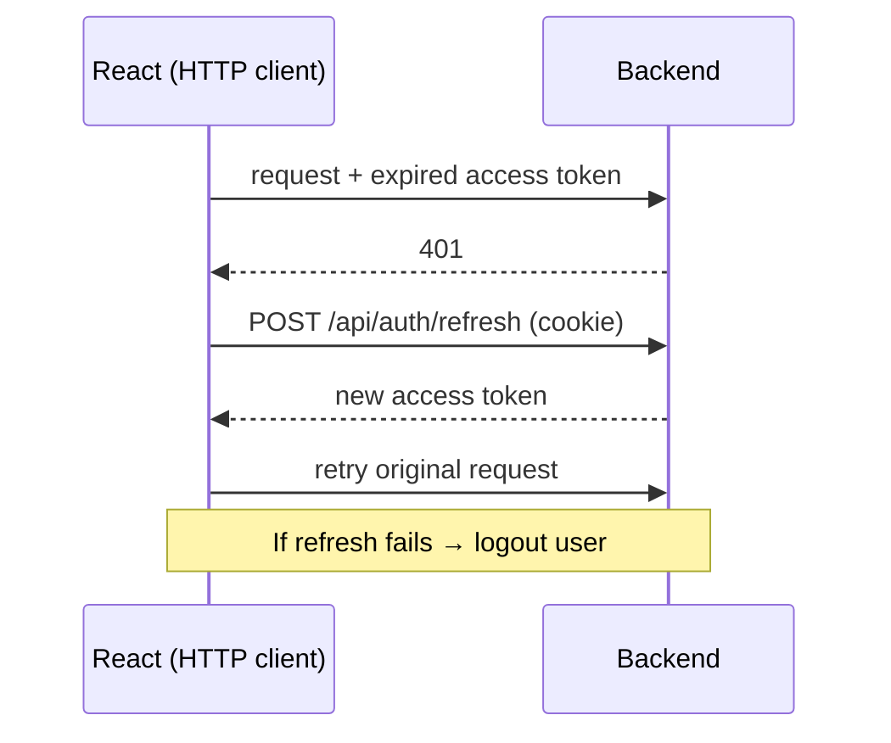

## 17. OpenFeign Communication

**Status: ✅ IMPLEMENTED**

Declarative synchronous HTTP: `@FeignClient(name = "user-service")` and `@FeignClient(name = "product-service")`. No hardcoded URLs; Eureka resolves names.

| Caller | Callee | Purpose |
|---|---|---|
| Order Service | User Service | Get/validate user address |
| Order Service | Product Service | Get product, get multiple products, reserve inventory, release inventory |

### Order Creation Flow (Current, Synchronous) ✅

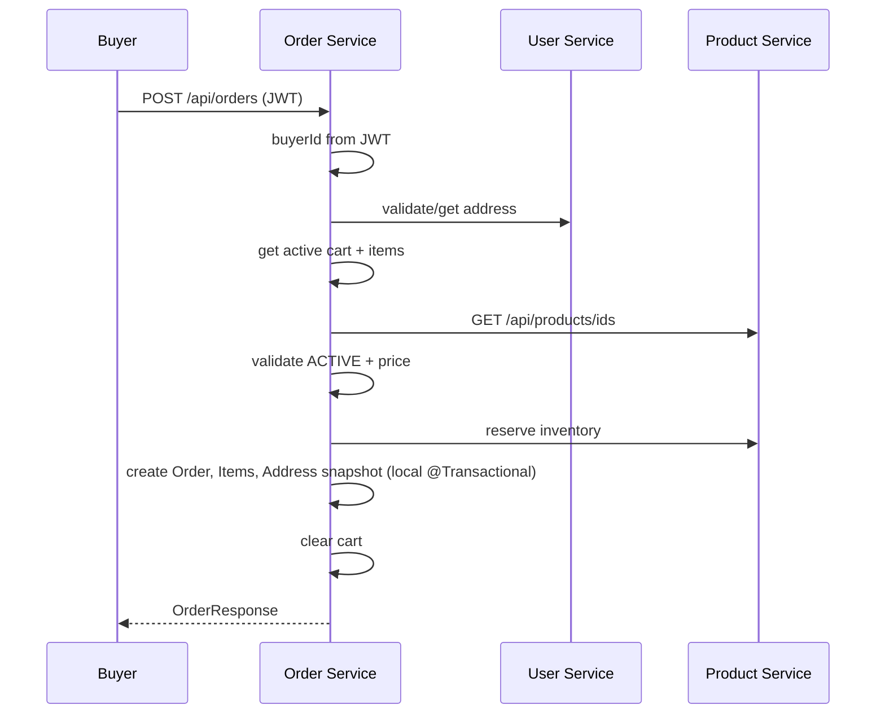

**Verified post-order state:** `availableQuantity` decreases, `reservedQuantity` increases, order/items/address created, cart cleared.

Cart add-item behaviour: Order Service → Product Service → get product → verify status → use current price → add/update CartItem. Product Service remains the source of truth for current product information.

## 18. Eureka Service Discovery

**Status: ✅ IMPLEMENTED + VERIFIED** — runs at `localhost:8761`; `user-service`, `product-service`, `order-service` register and show `UP`.

> **Eureka is a service registry, NOT a reverse proxy.** It does not forward application requests.

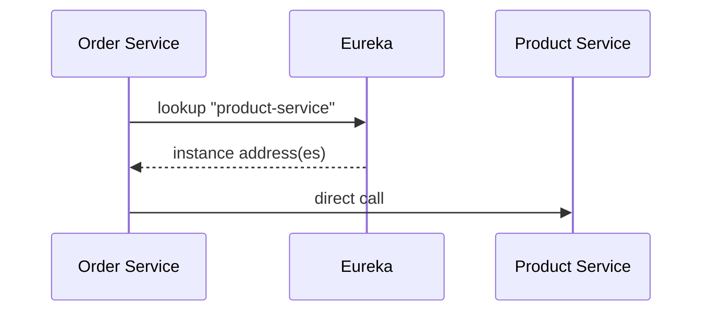

Benefits: no hardcoded locations, support for multiple instances, dynamic discovery.

## 19. API Gateway

**Status: ⏭️ NEXT (Phase 10)** — Spring Cloud Gateway on `:8080`, discovering backends through Eureka.

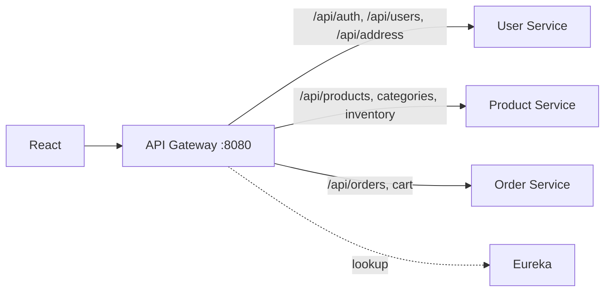

Responsibilities: routing, central entry point, CORS, request filtering, authentication-related filtering, rate limiting (429), correlation IDs, request logging. Downstream services keep validating JWTs independently (defense in depth). Route prefixes above are illustrative; final routes depend on the implemented controllers.

## 20. Kafka Architecture

**Status: 📋 PLANNED (Phase 13)** — asynchronous event backbone for event-driven communication, notifications, analytics, loose coupling, Saga events, and search synchronization.

Potential topics: `order.created`, `order.confirmed`, `order.cancelled`, `inventory.reserved`, `inventory.released`, `inventory.failed`, `product.created`, `product.updated`, `product.deleted`, `notification.created`.

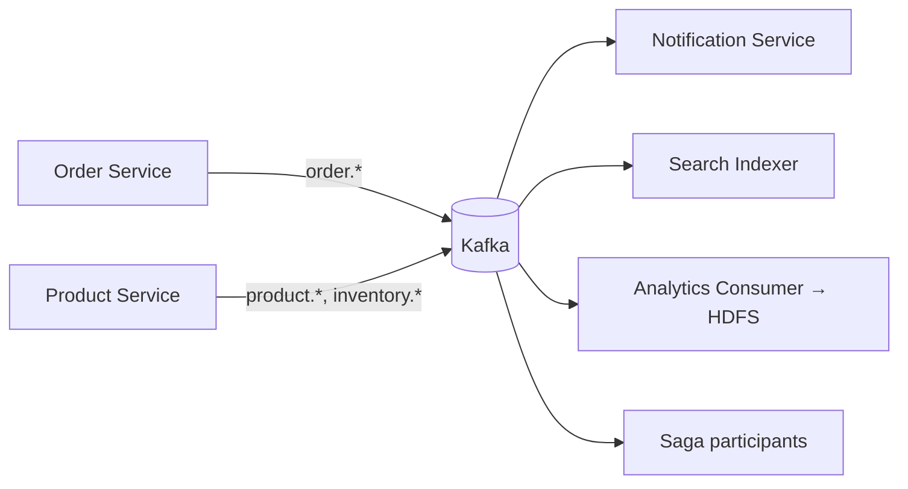

## 21. Event Design

Every event contains: `eventId`, `eventType`, `timestamp`, `aggregateId`, `payload`.

```json
{
  "eventId": "uuid",
  "eventType": "ORDER_CREATED",
  "timestamp": "2026-08-25T10:30:00",
  "orderId": "uuid",
  "buyerId": "uuid",
  "totalAmount": 2500.00
}
```

### Idempotent Consumption

Kafka may deliver duplicates, so consumers deduplicate by `eventId` using a `processed_events(event_id, processed_at)` table.

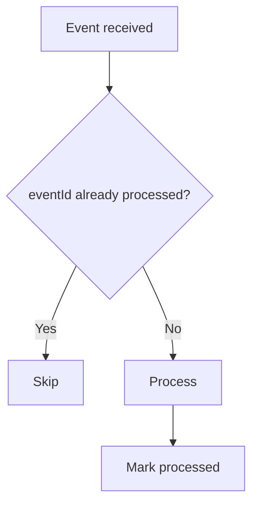

## 22. Saga Architecture

**Status: 📋 PLANNED (Phase 14)**

`@Transactional` cannot provide one atomic transaction across `order_db`, `product_db`, and a payment database. The final architecture uses the **Saga pattern** with Kafka events.

Forward flow:

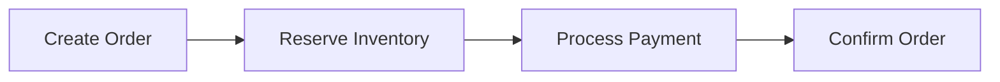

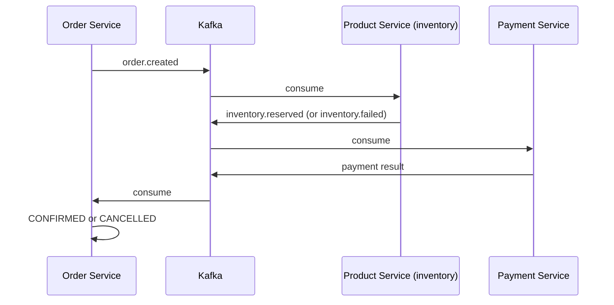

The exact coordination style (choreography vs. orchestration) is a design decision to be recorded as an ADR when Phase 14 begins. Local `@Transactional` remains valid within a single service (e.g., Order + OrderItems + OrderAddress).

## 23. Compensation

| Failure | Compensation |
|---|---|
| Payment fails after inventory reserved | Release inventory → Cancel order |
| Inventory reservation fails | Cancel order (`inventory.failed`) |

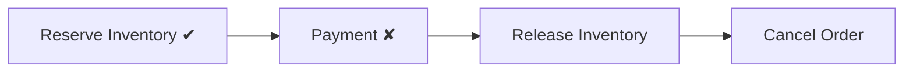

Compensations must themselves be idempotent (§21).

## 24. Inventory Concurrency

**Status: ✅ Optimistic locking IMPLEMENTED**

```java
@Version
private Long version;
```

Scenario: `availableQuantity = 1`; Buyer A and Buyer B both read 1 and attempt to purchase. Without concurrency control both could succeed. Optimistic locking makes the second concurrent write fail on version mismatch.

Operations: reserve (`available -= q; reserved += q`), release (`reserved -= q; available += q`), deduct (`reserved -= q`). Quantities are validated; invalid operations are rejected (`InsufficientStockException`, `InvalidInventoryOperationException`). The final distributed reservation design must ensure atomic stock reservation.

## 25. Elasticsearch

**Status: 📋 PLANNED (Phase 16)**

**Principle:** MySQL remains the **source of truth**; Elasticsearch is a **search/read optimization**, never the transactional database.

```mermaid
flowchart LR
  PS[Product Service] --> K[(Kafka product.*)] --> SI[Search Indexer] --> ES[(Elasticsearch)]
  FE[React] --> GW[Gateway] -->|GET /api/search/products?q=| ES
```

Capabilities: full-text, fuzzy, prefix search, category and price filtering, sorting, pagination. Searchable fields: `name`, `description`, `brand`, `category`. Consequence: index is eventually consistent with MySQL.

## 26. Notification / WebSocket

**Status: 📋 PLANNED (Phases 17)**

```mermaid
flowchart LR
  OS[Order Service] --> K[(Kafka)] --> NS[Notification Service] --> WS[WebSocket] --> R[React]
```

React holds a persistent WebSocket connection, eliminating polling. Notifications: order confirmed / shipped / delivered / cancelled; seller-related inventory notifications where required.

## 27. Resilience4j

**Status: 📋 PLANNED (Phase 15)** — Circuit Breaker, Retry, Rate Limiter, Time Limiter, Bulkhead, applied where appropriate (e.g., Order → Product calls).

```mermaid
stateDiagram-v2
  [*] --> CLOSED
  CLOSED --> OPEN: failures exceed threshold
  OPEN --> HALF_OPEN: wait elapsed
  HALF_OPEN --> CLOSED: success
  HALF_OPEN --> OPEN: failure
```

Rate limiting candidates: Login, Search, Product APIs, Order APIs (e.g., 100 req/min/user, exceeded → **429**). Limits must be configurable.

## 28. Distributed Tracing

**Status: 📋 PLANNED (Phase 18)** — OpenTelemetry + Zipkin or compatible backend. Each request carries `traceId`, `spanId`, `correlationId`, flowing React → Gateway → Order → Product → Kafka → Notification, so one trace shows the whole journey.

## 29. Logging / Observability

Structured logs include `timestamp, service, traceId, correlationId, level, message, exception`.

| Pillar | Purpose |
|---|---|
| Logging | Discrete events and errors |
| Metrics | Aggregated numeric health/performance |
| Distributed tracing | Per-request cross-service path |
| Health checks | Liveness/readiness |

## 30. Docker

**Status: 📋 PLANNED (Phase 19)** — Compose services: `frontend, api-gateway, user-service, product-service, order-service, cart-service, payment-service, notification-service, analytics-service, eureka-server, kafka, elasticsearch, mysql, tracing, hadoop, spark`. Internal communication uses Docker service names, not `localhost`.

## 31. Configuration Management

Never hardcode DB URLs, JWT secrets, Kafka/Elasticsearch/service URLs, or credentials. Use `application.yml`, environment variables, Docker environment variables, and (planned) **Spring Cloud Config Server**. **Secrets are never committed to Git.**

## 32. HDFS

**Status: 📋 PLANNED (Phase 20)** — historical order data lands in HDFS via a Kafka consumer, partitioned:

```text
/hdfs/ecommerce/orders/year=2026/month=08/day=25/
```

## 33. Spark

**Status: 📋 PLANNED (Phase 21)** — processes HDFS data. Analytics: total sales, sales by day/month/category, top-selling products, top buyers, average order value, orders per day, revenue per seller, product popularity.

## 34. Analytics Pipeline

```mermaid
flowchart LR
  OS[Order Service] --> K[(Kafka)] --> C[Kafka Consumer] --> H[(HDFS)] --> S[Apache Spark] --> R[Analytics Reports]
```

Purpose: demonstrate a real data pipeline, not just installed Hadoop/Spark.

## 35. Testing Architecture

| Level | Tools | Scope |
|---|---|---|
| Unit | JUnit 5, Mockito | Services, mappers, utilities, validators, business rules |
| Integration | Spring Boot Test, Testcontainers (MySQL, Kafka, Elasticsearch) | Persistence, messaging, search |
| API | — | Authentication, products, inventory, cart, orders, addresses: status codes, bodies, validation, authorization, errors |
| Security | — | 401 unauthenticated, 403 wrong role, seller ownership, admin access |
| End-to-end | — | Phase 22 final validation |

The verified business flow in §4 is the current manual end-to-end baseline.

## 36. Security Architecture

| Concern | Approach |
|---|---|
| Passwords | BCrypt |
| Authentication | JWT (access + refresh) |
| Authorization | RBAC, enforced in backend |
| Transport | HTTPS in production |
| Secrets | Environment/configuration; never in Git |
| Role assignment | Backend-only; frontend can't choose `ADMIN`/`SELLER` via buyer registration |
| Identity | Buyer/seller IDs from JWT, not request payloads |
| Frontend | `ProtectedRoute`/`RoleBasedRoute` for UX only |
| Service-to-service | Header propagation; each service validates JWT |

## 37. Scalability

Services scale independently (e.g., Product ×N, Order ×N, Search ×N). Eureka enables multiple instances; Gateway/Feign load-balance. Kafka decouples load spikes; Elasticsearch offloads search; pagination bounds payloads.

## 38. Reliability

Optimistic locking (✅), Saga, idempotency, compensation, retries, circuit breakers (📋). Availability aids: circuit breaker, retry, bulkhead, service discovery. Caching only where justified.

## 39. Deployment Architecture

```mermaid
flowchart TB
  subgraph Docker Compose 📋
    FE[frontend] --> GW[api-gateway]
    GW --> EU[eureka-server]
    GW --> US[user-service]
    GW --> PS[product-service]
    GW --> OS[order-service]
    GW --> CS[cart-service]
    GW --> PAY[payment-service]
    OS --> KF[kafka]
    KF --> NS[notification-service]
    KF --> AN[analytics-service]
    US --> MY[(mysql)]
    PS --> MY
    OS --> MY
    PS --> ES[(elasticsearch)]
    AN --> HD[hadoop / HDFS]
    HD --> SP[spark]
    TR[tracing backend]
  end
```

Today, services run locally on ports 8081–8083 with Eureka on 8761.

**Repository layout:** `frontend/`, one directory per service (`user-service`, `product-service`, `order-service`, `cart-service`, `payment-service`, `notification-service`, `analytics-service`, `api-gateway`, `eureka-server`), `infrastructure/{docker,kafka,elasticsearch,hadoop,tracing}`, `documentation/{Architecture.md,prd.md,API.md}`, `docker-compose.yml`.

### Frontend Architecture ✅ (structure)

React with `api/`, `components/`, `pages/`, `context/` (Auth, Cart), `hooks/`, `services/`, `utils/`, `routes/`. Routes: public (`/login, /register, /products, /products/:id`); buyer (`/cart, /orders, /orders/:id, /profile`); seller (`/seller`, `/seller/products`, `/seller/products/add`, `/seller/products/:id/edit`, `/seller/inventory`); admin (`/admin`, `/admin/users`, `/admin/users/:id`). A centralized HTTP client (Axios) attaches the access token, handles 401, refreshes, retries, logs out on refresh failure, and handles errors globally. After the gateway, the frontend targets it exclusively.

## 40. Development Roadmap

| Phase | Name | Status |
|---|---|---|
| 1 | Database & domain design | ✅ |
| 2 | Spring Boot monolith | ✅ |
| 3 | REST APIs (DTOs, validation, pagination) | ✅ |
| 4 | Security (JWT, refresh, RBAC) | ✅ |
| 5 | React | ✅ |
| 6 | Testing | ✅ / ongoing |
| 7 | Microservice extraction (User, Product, Order) | ✅ |
| 8 | OpenFeign | ✅ |
| 9 | Eureka | ✅ |
| 10 | API Gateway | ⏭️ NEXT |
| 11 | Cart & Checkout extraction | 📋 |
| 12 | Payment Service | 📋 |
| 13 | Kafka | 📋 |
| 14 | Saga | 📋 |
| 15 | Resilience4j | 📋 |
| 16 | Elasticsearch | 📋 |
| 17 | WebSocket notifications | 📋 |
| 18 | Distributed tracing | 📋 |
| 19 | Docker | 📋 |
| 20 | Hadoop / HDFS | 📋 |
| 21 | Spark | 📋 |
| 22 | End-to-end testing | 📋 |

Config Server is planned for centralized configuration; its phase placement is to be decided.

## 41. Architecture Decisions (ADRs)

| ADR | Decision | Reason |
|---|---|---|
| Database per service | Each microservice owns its DB | Loose coupling, independent deployment/scaling, ownership |
| OpenFeign | Synchronous inter-service calls | Declarative client, Spring Cloud integration, works with Eureka |
| Eureka | Service discovery | No hardcoded locations, multiple instances, dynamic discovery |
| API Gateway | Spring Cloud Gateway as single entry | Hide topology, centralize cross-cutting concerns |
| Kafka | Async events | Loose coupling, analytics, notifications, Saga |
| Saga | Distributed transactions | Avoid distributed DB transactions, support compensation, handle partial failure |
| Elasticsearch | Product search | Full-text, fuzzy, filtering, scalability |
| MySQL as source of truth | Elasticsearch only for reads | Transactional integrity |
| Order snapshot | Copy product/address data into orders | Historical accuracy |
| Logical cross-service IDs | No cross-DB foreign keys | Ownership rule |
| Independent JWT validation | Each service validates | Defense in depth; no implicit trust |
| Monolith first | Build working app then decompose | Understandable at every stage |

## 42. Trade-offs

**Microservices** — *Advantages:* independent scaling/deployment, clear ownership, fault isolation. *Costs:* operational complexity, network failures, distributed transactions, observability and deployment complexity.

**Kafka** — *Advantages:* asynchronous processing, loose coupling, durable stream. *Costs:* operational complexity, eventual consistency, duplicates, ordering considerations.

**Elasticsearch** — *Advantages:* powerful search. *Costs:* extra infrastructure, data synchronization, eventual consistency.

**Snapshots in orders** — *Advantage:* stable history. *Cost:* data duplication.

**Optimistic locking** — *Advantage:* no blocking under low contention. *Cost:* retries/conflicts under high contention.

## 43. Risks

| Risk | Mitigation |
|---|---|
| Inventory/order inconsistency (current) | Saga + compensation; document limitation |
| Duplicate Kafka events | Idempotent consumers via `eventId` |
| Search index lag | Accept eventual consistency; MySQL is truth |
| Synchronous cascade failures | Resilience4j; timeouts; bulkheads |
| Secret leakage | Config/env variables; never commit; Config Server |
| Scope/complexity growth | Strict phased roadmap; one technology at a time |
| Weak frontend-only authorization | Backend enforces all authorization |
| Infrastructure weight (Kafka, ES, Hadoop, Spark) on dev machines | Docker Compose profiles; phased introduction |
| Cart extraction destabilizing orders | Extract only after Order flow is stable |

## 44. Future Enhancements

🔮 Concrete payment-provider integration (not yet selected); admin bootstrap mechanism; seller-scoped notifications; expanded analytics reports; caching where justified; additional payment states. No features beyond those described in this document are committed.
